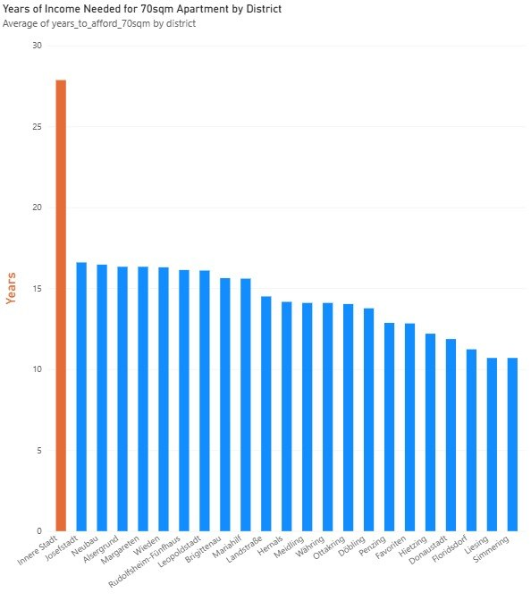
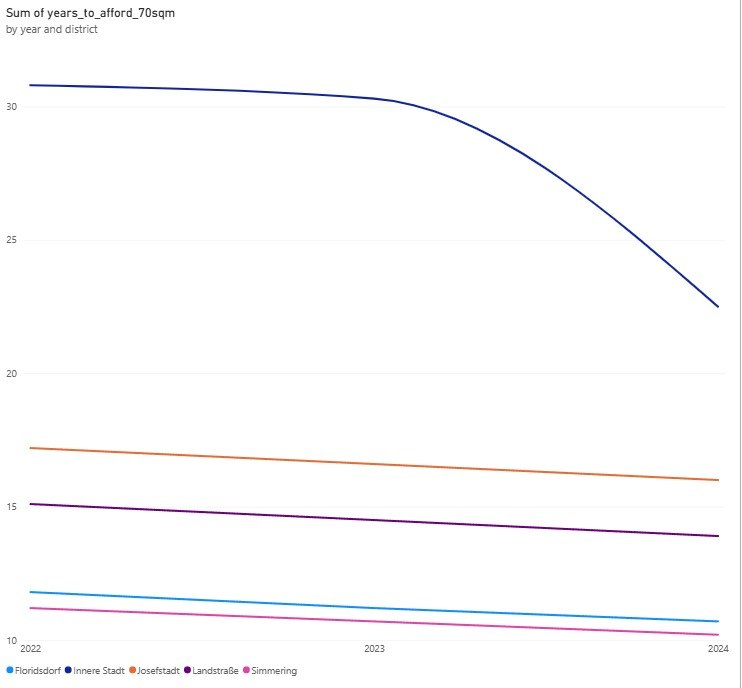

# Vienna Housing Affordability by District 🏘️

A SQL + Power BI analysis of how housing affordability has changed across Vienna's 23 districts (2022–2024), and what that means for mortgage lending risk.

## The problem

Vienna's housing prices vary enormously by district — from around €3,000/m² in the outer districts to over €8,000/m² in the Innere Stadt. For banks issuing mortgages, this matters directly: the higher the price-to-income ratio in a district, the higher the risk that a loan becomes unaffordable for the borrower.

This project asks a simple question: **in which districts would a household need to save the most years of income to afford a typical apartment — and how has that changed over time?**

## Data sources

- **Real estate prices**: [Statistik Austria – Immobiliendurchschnittspreise](https://www.statistik.at/statistiken/volkswirtschaft-und-oeffentliche-finanzen/preise-und-preisindizes/immobilien-durchschnittspreise) — official average prices per m² by district, 2022–2024
- **Household income**: [Stadt Wien – Durchschnittlicher Jahresbezug pro ArbeitnehmerIn nach Bezirken](https://www.wien.gv.at/statistik/einkommen-bezirke-zeitreihe) — average net annual income by district, most recent available year (2018)

**Known limitation**: the income data only goes up to 2018, while price data covers 2022–2024. There is no more recent open dataset for district-level income in Vienna at the time of writing. The affordability index therefore compares current prices against 2018 income — a real constraint of the available data, not an oversight. Results should be read as directionally correct, not as precise present-day figures.

## The metric

I built a custom metric, **years to afford a 70m² apartment**:

```
years_to_afford_70sqm = (avg_price_per_sqm × 70) / net_annual_income
```

70m² was chosen as a representative apartment size; this assumption is explicit and could be adjusted.

## Database design

Rather than one flat table, the data is structured as a small star schema:

- `districts` — reference table, one row per district (primary key)
- `real_estate_prices` — price per m² by district and year (foreign key → districts)
- `district_income` — net income by district (foreign key → districts)

Foreign key constraints are enforced (`PRAGMA foreign_keys = ON`), so the database itself rejects any row referencing a district that doesn't exist in the reference table — this was tested by deliberately trying to insert a misspelled district name, which SQLite correctly rejected with a `FOREIGN KEY constraint failed` error.

## A real data-cleaning problem I ran into

When importing prices from a CSV exported via Google Sheets, numbers like `8496` were silently read as `8` in every calculation — no error was thrown, the query just returned wrong (near-zero) results. Using SQLite's `hex()` function, I found the cause: Google Sheets had exported the thousands separator as a **non-breaking space** (Unicode U+00A0 / `C2A0` in UTF-8), which looks identical to a normal space but isn't one, so `REPLACE(value, ' ', '')` silently failed to remove it.

Fix: `REPLACE(value, CHAR(160), '')` before casting to a numeric type.

This kind of invisible formatting issue is a common real-world data-quality problem, and diagnosing it (rather than just re-typing the numbers) was one of the more useful things I learned building this.

## Key findings (2024)





| Rank | District | Years of income needed (70m²) |
|---|---|---|
| 1 | Innere Stadt | 22.5 |
| 2 | Josefstadt | 16.0 |
| 3 | Wieden | 15.9 |
| ... | ... | ... |
| 22 | Liesing | 10.3 |
| 23 | Simmering | 10.2 |

- **Innere Stadt is a clear outlier** — roughly 40% higher than the second-most expensive district, and its index swung sharply between 2023 (30.3 years) and 2024 (22.5 years), most likely reflecting the small number of actual transactions in that district (noted directly in the Statistik Austria source methodology) rather than a genuine market shift.
- The **outer districts** (Simmering, Liesing, Floridsdorf) are consistently the most affordable, and stayed relatively stable across all three years.

## Repository structure

```
data/raw/        original Statistik Austria spreadsheet (.ods)
data/prepared/   CSVs prepared in Google Sheets, input for SQL
data/output/     final affordability table (exported from the SQL view)
sql/             full SQL pipeline: schema, cleaning, view, analysis queries
database/        resulting SQLite database
images/          Power BI chart screenshots
```

To reproduce: import the two CSVs from `data/prepared/` into an empty SQLite database (as `raw_prices` and `raw_income`) and run `sql/analysis.sql` — see the comments at the top of the script.

## Tools used

- **SQLite** (via DB Browser for SQLite) — data storage, cleaning, and analysis
- **SQL** — joins, subqueries, aggregate functions, views, schema design with primary/foreign keys
- **Power BI** — bar chart and multi-year line chart visualizations
- **Google Sheets** — initial data preparation from raw Statistik Austria spreadsheets

## What I'd add next

- A choropleth map of Vienna by district — attempted using Power BI's Filled Map and Azure Maps visuals, but ran into real technical limits: Bing's geocoding doesn't resolve city-district-level boundaries (it returns the whole city outline instead), and Azure Maps' custom reference layer feature requires an organizational Microsoft account, which isn't available on a personal account. Left for a future version, possibly using Python (folium/geopandas) instead.
- More recent income data, if/when Statistik Austria or Stadt Wien publish an update past 2018.
- Extending the affordability index with mortgage interest rates (ECB/OeNB data) to model actual monthly payment burden, not just raw price-to-income.

## A note on process

I used Claude (Anthropic) as a learning assistant while building this — to learn SQL from scratch, debug the invisible-character issue, and figure out the database schema design. I understand and can explain the reasoning behind every query and design decision in this project; I'm noting the AI use here for transparency rather than leaving it unsaid.

---

*Built by a high school student (Vienna-bound, planning to study Wirtschaftsinformatik) as a first hands-on SQL + Power BI project.*
